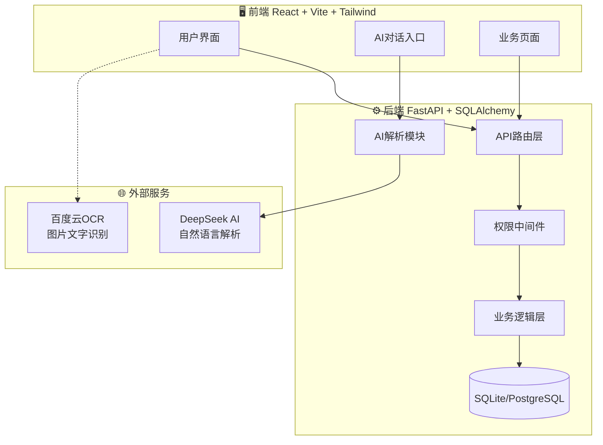
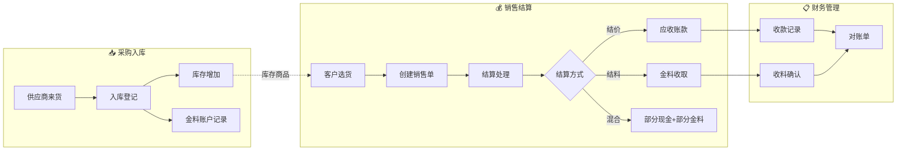
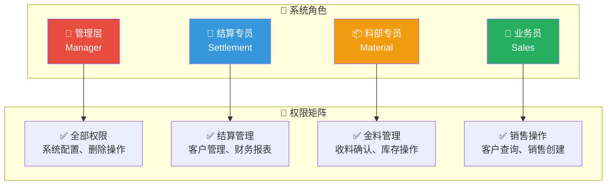
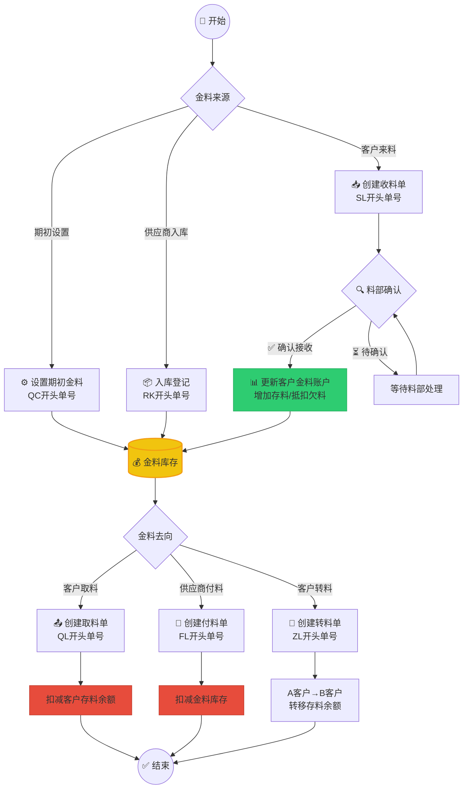
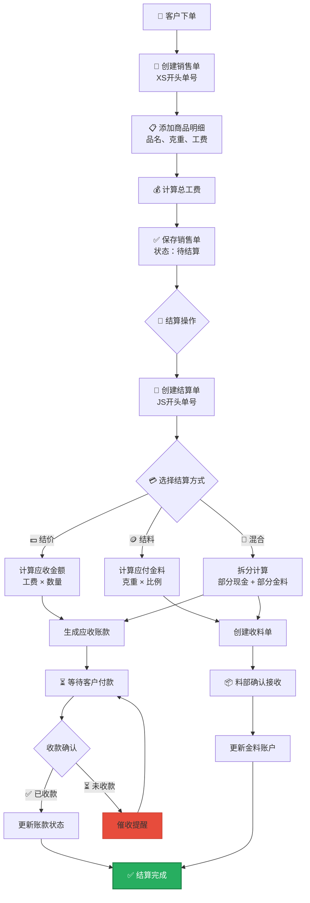
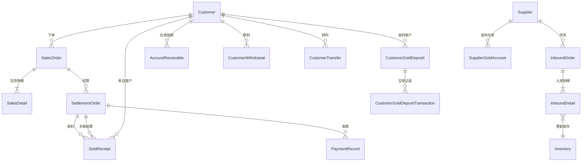
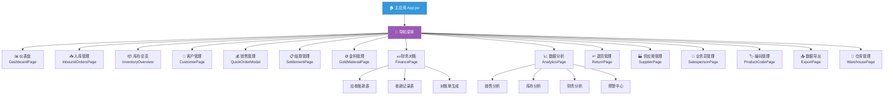
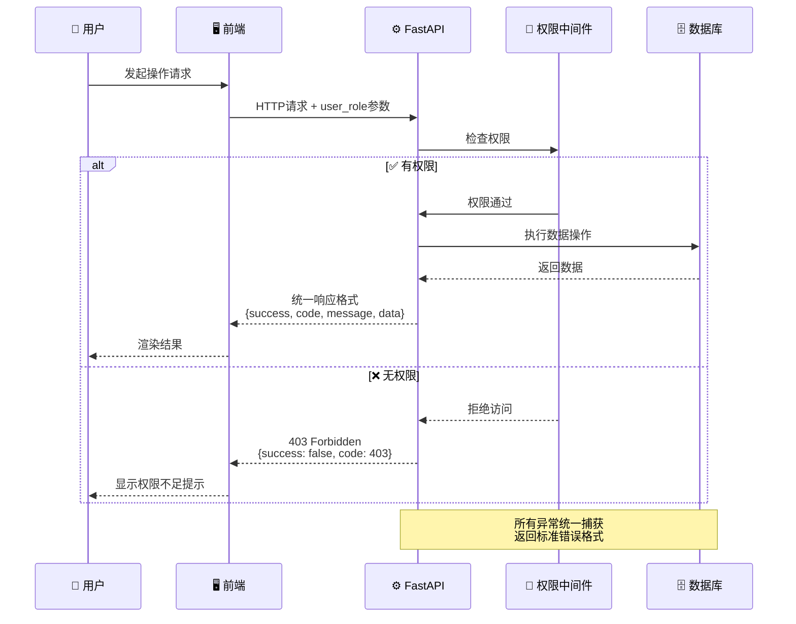

# 📊 珠宝ERP系统流程图

> 本文档包含系统架构、业务流程、数据模型等可视化图表  
> 使用 Mermaid 语法，支持在 GitHub、VSCode、Typora 等工具中渲染

---

## 目录

1. [系统整体架构](#1-系统整体架构)
2. [核心业务流程](#2-核心业务流程)
3. [角色权限体系](#3-角色权限体系)
4. [金料流转流程](#4-金料流转流程)
5. [销售结算流程](#5-销售结算流程)
6. [数据模型关系](#6-数据模型关系)
7. [前端页面结构](#7-前端页面结构)
8. [API请求流程](#8-api请求流程)
9. [模块功能汇总](#9-模块功能汇总)

---

## 1. 系统整体架构



### 技术栈说明

| 层级 | 技术 | 说明 |
|------|------|------|
| 前端 | React + Vite + Tailwind CSS | 现代化响应式UI |
| 后端 | Python + FastAPI | 高性能异步API |
| 数据库 | SQLite / PostgreSQL | 开发/生产环境 |
| AI | DeepSeek API | 自然语言入库解析 |
| 部署 | Railway + Vercel | 自动化CI/CD |

---

## 2. 核心业务流程



### 业务流程说明

1. **采购入库**：供应商送货 → 入库登记（商品信息、工费、克重）→ 库存更新
2. **销售结算**：客户选货 → 创建销售单 → 选择结算方式（结价/结料/混合）
3. **财务管理**：应收账款跟踪 → 收款/收料确认 → 生成对账单

---

## 3. 角色权限体系



### 权限详细说明

| 角色 | 权限范围 | 禁止操作 |
|------|----------|----------|
| 管理层 | 全部功能 | 无 |
| 结算专员 | 结算、客户、应收账款、报表 | 删除数据、系统配置 |
| 料部专员 | 金料收发、库存查看、取料确认 | 结算、财务、删除 |
| 业务员 | 销售创建、客户查询、自己的销售记录 | 结算、金料、删除 |

---

## 4. 金料流转流程



### 金料单据编号规则

| 类型 | 前缀 | 示例 | 说明 |
|------|------|------|------|
| 期初金料 | QC | QC20250122143000 | 系统初始化设置 |
| 收料单 | SL | SL20250122143000 | 客户送料至公司 |
| 付料单 | FL | FL20250122143000 | 公司付料给供应商 |
| 取料单 | QL | QL20250122143000 | 客户从公司取料 |
| 转料单 | ZL | ZL20250122143000 | 客户间转让存料 |

---

## 5. 销售结算流程



### 结算方式对比

| 方式 | 适用场景 | 客户支付 | 公司收取 |
|------|----------|----------|----------|
| 结价 | 客户现金结算 | 现金/转账 | 应收账款 |
| 结料 | 客户用金料抵扣 | 实物黄金 | 金料入库 |
| 混合 | 部分现金+部分金料 | 现金+黄金 | 账款+金料 |

---

## 6. 数据模型关系



### 核心数据表说明

| 表名 | 说明 | 主要字段 |
|------|------|----------|
| `customers` | 客户信息 | name, phone, total_purchase |
| `sales_orders` | 销售单 | order_no, customer_id, total_labor_cost |
| `sales_details` | 销售明细 | product_name, weight, labor_cost |
| `settlement_orders` | 结算单 | payment_method, total_amount |
| `gold_receipts` | 收料单 | gold_weight, status, customer_id |
| `inventory` | 库存 | product_name, quantity, weight |

---

## 7. 前端页面结构



---

## 8. API请求流程



### API响应格式

```json
{
    "success": true,
    "code": 200,
    "message": "操作成功",
    "data": {
        "items": [...],
        "total": 100
    }
}
```

---

## 9. 模块功能汇总

| 模块 | 功能描述 | 后端文件 | 前端组件 |
|------|----------|----------|----------|
| 📥 入库管理 | 商品入库登记、库存更新 | `warehouse.py` | `InboundOrdersPage` |
| 👥 客户管理 | 客户CRUD、欠款查询、往来账 | `customers.py` | `CustomerPage` |
| 💰 销售管理 | 销售单创建、明细管理 | `sales.py` | `QuickOrderModal` |
| 📋 结算管理 | 结价/结料结算处理 | `settlement.py` | `SettlementPage` |
| 🪙 金料管理 | 收料/付料/取料/转料 | `gold_material.py` | `GoldMaterialPage` |
| 💵 财务对账 | 应收账款、收款记录、对账单 | `finance.py` | `FinancePage` |
| 📈 数据分析 | 销售/库存/财务报表 | `analytics.py` | `AnalyticsPage` |
| ↩️ 退货管理 | 退货单处理 | `returns.py` | `ReturnPage` |
| 🏭 供应商管理 | 供应商CRUD、金料往来 | `suppliers.py` | `SupplierPage` |
| 👔 业务员管理 | 业务员CRUD | `salespersons.py` | `SalespersonPage` |
| 🏷️ 编码管理 | 商品编码配置 | `product_codes.py` | `ProductCodePage` |
| 📤 数据导出 | Excel/PDF导出 | `export.py` | `ExportPage` |

---

## 附录：单据编号规则

| 单据类型 | 前缀 | 格式 | 示例 |
|----------|------|------|------|
| 入库单 | RK | RK + 日期8位 + 随机4位 | RK202501220001 |
| 销售单 | XS | XS + 时间戳14位 | XS20250122143000 |
| 结算单 | JS | JS + 时间戳14位 | JS20250122143000 |
| 收料单 | SL | SL + 时间戳14位 | SL20250122143000 |
| 付料单 | FL | FL + 时间戳14位 | FL20250122143000 |
| 取料单 | QL | QL + 时间戳14位 | QL20250122143000 |
| 转料单 | ZL | ZL + 时间戳14位 | ZL20250122143000 |
| 期初金料 | QC | QC + 时间戳14位 | QC20250122143000 |
| 客户编号 | KH | KH + 时间戳14位 | KH20250122143000 |

---

> 📅 最后更新：2025-01-22  
> 📝 维护者：AI Assistant

